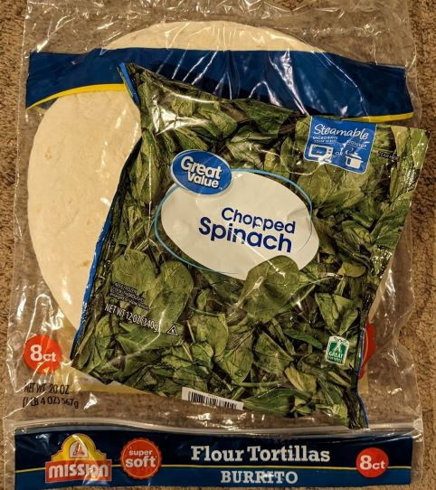

#  BBQ Spinach Wrap

    This recipe will teach you how to make a delicious BBQ Spinach Wrap. Great for eating with your hands. Easy meal for one.

## Preperation: 18 minutes
---

### Number of Servings: 
- 1 Serving
### Serving Size: 
- 1 BBQ Spinach Wrap
### Nutrition Information:
- 300 - 400 Calories

---

## Ingredients (In order of Appearance):
1. **Margarine** - 2 tbsp
2. **Minced Onion** - 1/2 cup
3. Great Value **Bagged Frozen Spinach** - 1/2 bag
4. **Cashews** - 1/4 cup
5. **Cumin** - 2 tbs
6. **Paprika** - 1 tbs
7. **Cinnamon** - 1 tbs
8. **Black Pepper** - 1 tbs
9. **Lemon Juice** - 3 squirts
10. **Cayenne Pepper** - 2 tbs.
11. Great Value **BBQ Sauce** - 1/4 cup
12. **Tortilla** - 1 (burrito size)

---

## Tools needed:
 - *Hotplate*
 - *Pan*
 - *Lid*
-  *Sheet paper towel*
-  *Stirring implement of any kind*

---

## Directions:
### Step 1:
- Melt 2 tbsp of **Margarine** on a medium hot *pan*.

### Step 2:
- Pour 1/2 cup **Minced Onion** evenly across *pan*. Allow to sizzle for 2 minutes.

### Step 3:
- After **Minced Onion** has begun to change color, pour 1/2 bag of **Frozen Spinach** evenly onto the *pan*.

### Step 4:
- Add 1/4 cup **Cashews** to the *pan*.

### Step 5:
- Place *lid* on *pan* and turn down heat to medium low. Allow to cook for approx. 4 minutes or until **Spinach** is mostly unfrozen.

### Step 6:
- Once **Spinach** is mostly unfrozen, Begin spicing by adding - 
  - 2 tbs - **Cumin**
  - 1 tbs - **Paprika**
  - 1 tbs - **Cinnamon**
  - 1 tbs - **Black Pepper**

#### Note:
    Do Not Add **Cayenne Pepper** Yet!
    
    Adding Cayenne Pepper at this step without good ventilation can cause discomfort to eyes and throat.

### Step 7:
- Once spices added, use *stirring implement* to stir in spices and break up any remaining frozen **Spinach** chunks. Cover with *lid* again.

### Step 8:
- Once it appears that all the **Spinach** is thoroughly cooked, add 3 squirts of **Lemon Juice**, 2 tbs. of **Cayenne Pepper**, and 1/4 cup **BBQ Sauce** while turning the heat to low. Mix well.

### Step 9:
- Prepare the **Tortilla** by having it opened on the *paper towel*. 
- Turn off heat and use the *stirring utensil* to help you with pouring **Spinach** and friends into the **Tortilla**. 
#### Hint:
    Try to pour the cooked ingredients in a strait line in the middle of the Tortilla to make it easier to wrap.

### Step 10:
- Wrap the **Tortilla** with its newly aquired contents within then enjoy it in silent loneliness.

## Notes:
    You can use bread rather than a tortilla for a messier experience.

    Less spices can be used if you prefer bland food.

## FAQ:
### Q: Can I make this for friends?
    A: No, they will hate it.

### Q: How would I make more than one serving?
    A: Don't.

### Q: Should I make this for my parents?
    A: Please stop.

## Additional Features:
- Tastes not bad.
- Better for your health than whiskey.

